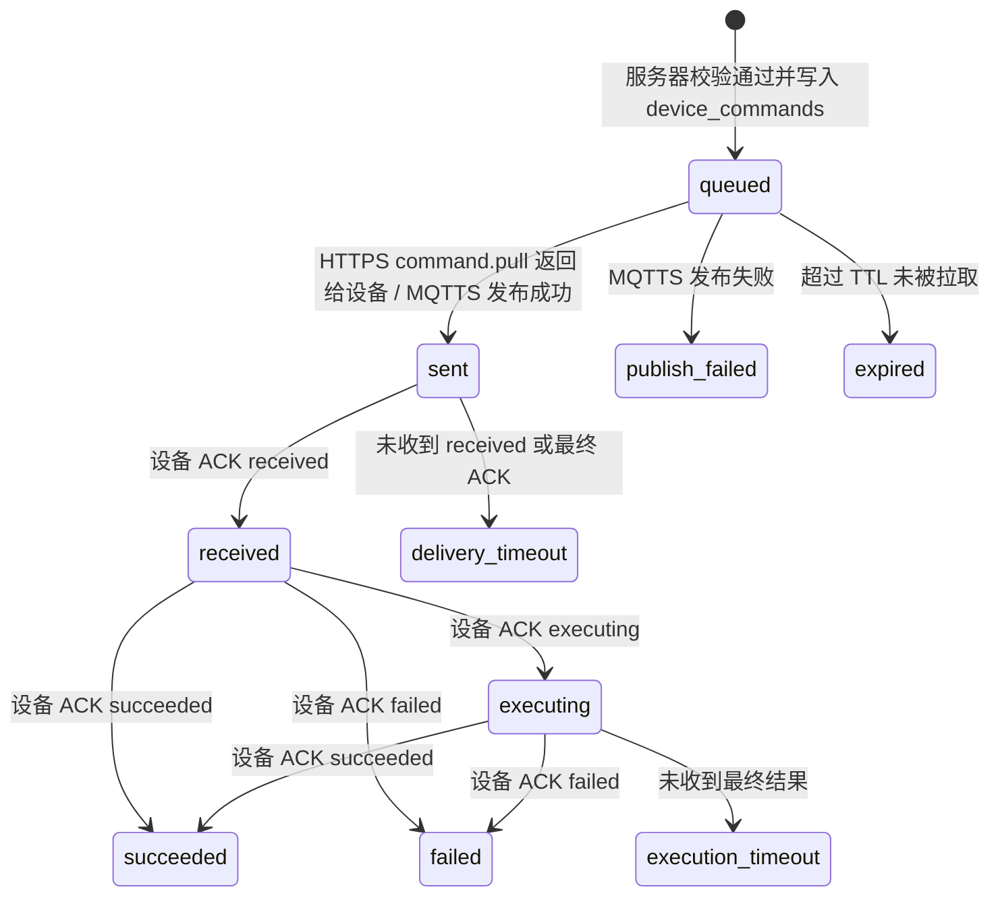

# 智能浇水设备能力驱动配置与控制命令系统设计

## 1. 设计结论

智能浇水设备的管理界面不应先假定所有浇水设备都支持相同功能，也不应在用户首次绑定后自动生成一套看起来“已经配置完成”的默认参数。

推荐结论：

1. **云端不应把默认值写成真实配置。** 设备首次绑定后，业务配置应为空，状态为 `unconfigured`。
2. **云端可以保存产品能力模板和推荐值，但推荐值只能作为占位提示或“一键填入推荐值”，不能当作已保存配置。**
3. **小程序必须先查询设备能力属性，再按能力动态显示功能项。** 例如只有设备上报支持土壤湿度传感器时，才显示“按需浇水”。
4. **用户显式填写并保存后，云端才生成 `desiredConfig` 和下发命令。**
5. **设备 ACK 成功后，配置才从“云端期望配置”变为“设备已应用配置”。**
6. **手动浇水是即时命令，不要求先保存配置。** 手动时长可以为空，用户点击开始前必须填写本次浇水秒数。

因此，首次绑定后的推荐状态是：

```json
{
  "capabilityState": "reported",
  "configState": "unconfigured",
  "desiredConfig": null,
  "appliedConfig": null,
  "desiredConfigVersion": 0,
  "appliedConfigVersion": 0,
  "message": "设备已绑定，请按需完成首次配置"
}
```

小程序展示：

```text
配置状态：未配置
功能来源：设备已上报能力
参数输入：空白，显示推荐值占位提示
```

而不是展示：

```text
配置状态：已同步
按需浇水：每 4 小时检测，低于 35% 浇水 20 秒
```

## 2. 产品功能定义原则

### 2.1 设备类型不等于功能集合

`deviceType = watering` 只能说明这是智能浇水设备，不能说明它一定具备以下能力：

- 土壤湿度传感器。
- 水箱水位检测。
- RTC 或本地定时器。
- 本地离线自动策略。
- 水泵电流检测。
- 多路水泵或多区域浇水。

因此，不能用 `deviceType=watering` 直接决定页面显示“按需浇水、定期浇水、手动浇水”三个模式。

正确做法是：

```text
小程序设备管理页 = 设备能力属性 + 云端配置状态 + 设备运行状态 的动态渲染结果
```

### 2.2 功能、组件、配置、状态分离

| 概念 | 示例 | 说明 |
| --- | --- | --- |
| 组件 `components` | 水泵、土壤传感器、水位传感器、RTC | 设备硬件或基础模块 |
| 功能 `features` | 手动浇水、定期浇水、按需浇水、水箱保护 | 由硬件组件和固件能力组合出来的产品功能 |
| 配置 `config` | 阈值、检测周期、浇水秒数 | 用户显式保存的业务参数 |
| 状态 `state` | 水泵开关、剩余秒数、当前湿度 | 设备实时运行状态 |
| 命令 `command` | 开始浇水、停止浇水、保存配置 | 云端下发给设备执行的动作 |

任何功能项是否显示，首先看 `features`，不是看本地写死的页面 tab。

## 3. 首次绑定后的配置状态

### 3.1 不自动生成默认业务配置

首次绑定成功后，云端可以保存设备能力，但不应自动生成真实业务配置。

推荐初始状态：

| 字段 | 值 | 说明 |
| --- | --- | --- |
| `capabilityState` | `reported` | 设备已通过 `provision.result` 或 `device.boot` 上报能力 |
| `configState` | `unconfigured` | 用户尚未保存配置 |
| `desiredConfig` | `null` | 云端没有用户期望配置 |
| `appliedConfig` | `null` | 设备没有被云端确认过的已应用配置 |
| `desiredConfigVersion` | `0` | 尚未生成配置版本 |
| `appliedConfigVersion` | `0` | 尚未确认设备应用配置 |

### 3.2 云端推荐值只能用于提示

云端可以保存如下产品推荐值：

```json
{
  "recommended": {
    "manualWatering.durationSeconds": 10,
    "scheduleWatering.durationSeconds": 30,
    "demandWatering.thresholdPercent": 35
  }
}
```

但它们只能用于：

- input 的 placeholder。
- “填入推荐值”按钮。
- 产品说明文案。

不能直接写入 `desiredConfig`，也不能让小程序显示为已配置。

### 3.3 小程序空配置展示

如果 `device.getStatus` 返回：

```json
{
  "configState": "unconfigured",
  "desiredConfig": null,
  "appliedConfig": null
}
```

小程序应展示：

```text
配置状态：未配置
请根据实际植物和环境设置浇水策略
```

字段输入框应为空，例如：

```text
手动浇水秒数：[      ] 秒
placeholder：例如 10

定期浇水间隔：[      ] 天
placeholder：例如 1
```

如果为了减少输入成本，可以提供：

```text
[填入推荐值]
```

用户点击后才把推荐值填入草稿，仍然要点击“保存并下发”才成为真实配置。

## 4. 设备能力上报设计

### 4.1 上报时机

设备必须在以下消息中上报能力：

| 消息 | 是否必须 | 说明 |
| --- | --- | --- |
| `provision.result` | 必须 | 首次配网成功时上报完整能力，云端绑定前即可保存能力快照 |
| `device.boot` | 条件必须 | 默认不带能力版本或 hash；仅在固件升级、硬件检测结果变化或能力参数范围变化时携带完整 `capabilities` |
| `telemetry.report` | 不要求 | 周期遥测只上报运行状态和配置版本，不要求携带 `capabilityHash` |

为简化设备端设计，`capabilityVersion` 和 `capabilityHash` 不是设备必填字段。云端如需排障摘要，可以对收到的完整 `capabilities` 自行计算并存储内部 hash。

### 4.2 能力对象总结构

设备上报的 `capabilities` 建议使用对象，不再只用字符串数组：

```json
{
  "schemaVersion": 1,
  "model": "YT-AW-BASIC-SM",
  "hwVersion": "1.0",
  "fwVersion": "0.1.0",
  "components": {
    "waterPump": {
      "present": true,
      "channels": 1,
      "feedback": "none"
    },
    "soilMoistureSensor": {
      "present": true,
      "valueType": "percent",
      "range": { "min": 0, "max": 100 },
      "calibratable": true
    },
    "waterLevelSensor": {
      "present": false
    },
    "rtc": {
      "present": false
    },
    "localStorage": {
      "present": true,
      "persistentConfig": true
    }
  },
  "features": {
    "manualWatering": {
      "supported": true,
      "label": "手动浇水",
      "commands": ["watering.manual.start", "watering.manual.stop"],
      "params": {
        "durationSeconds": {
          "type": "integer",
          "unit": "s",
          "required": true,
          "min": 1,
          "max": 3600,
          "recommended": 10,
          "default": null
        }
      }
    },
    "scheduleWatering": {
      "supported": true,
      "label": "定期浇水",
      "requires": ["waterPump", "localStorage"],
      "params": {
        "intervalDays": {
          "type": "integer",
          "unit": "day",
          "required": true,
          "min": 1,
          "max": 365,
          "recommended": 1,
          "default": null
        },
        "timesPerDay": {
          "type": "integer",
          "unit": "count",
          "required": true,
          "min": 1,
          "max": 24,
          "recommended": 2,
          "default": null
        },
        "durationSeconds": {
          "type": "integer",
          "unit": "s",
          "required": true,
          "min": 1,
          "max": 3600,
          "recommended": 30,
          "default": null
        }
      }
    },
    "demandWatering": {
      "supported": true,
      "label": "按需浇水",
      "requires": ["waterPump", "soilMoistureSensor", "localStorage"],
      "params": {
        "checkIntervalHours": {
          "type": "integer",
          "unit": "hour",
          "required": true,
          "min": 1,
          "max": 72,
          "recommended": 4,
          "default": null
        },
        "thresholdPercent": {
          "type": "integer",
          "unit": "%",
          "required": true,
          "min": 1,
          "max": 100,
          "recommended": 35,
          "default": null
        },
        "durationSeconds": {
          "type": "integer",
          "unit": "s",
          "required": true,
          "min": 1,
          "max": 3600,
          "recommended": 20,
          "default": null
        }
      }
    },
    "waterTankProtection": {
      "supported": false,
      "label": "缺水保护",
      "requires": ["waterLevelSensor"]
    }
  }
}
```

字段原则：

- `supported=false` 的功能小程序默认不显示，可在调试页或说明页展示为“不支持”。
- 参数 `default` 为 `null` 表示没有真实默认配置。
- `recommended` 只是推荐值，不能自动变成已保存配置。
- 小程序表单校验必须使用设备上报的 `min/max/required`，服务端也必须按同一能力约束二次校验。

## 5. 智能浇水设备功能模型

### 5.1 手动浇水 `manualWatering`

支持条件：

```text
waterPump.present = true
```

说明：

- 这是即时命令，不要求已有自动浇水配置。
- 输入为空时不能开始，必须由用户填写本次时长。
- 可显示推荐占位值，例如 “例如 10 秒”。

命令：

```text
watering.manual.start
watering.manual.stop
```

### 5.2 定期浇水 `scheduleWatering`

支持条件：

```text
waterPump.present = true
localStorage.persistentConfig = true
```

如果需要绝对时间点，例如每天 08:00，则还要求：

```text
rtc.present = true 或 设备能可靠从云端校时
```

首版可以使用相对周期：

```text
每 N 天浇 M 次，每次 S 秒
```

配置只有在用户保存后才存在。

### 5.3 按需浇水 `demandWatering`

支持条件：

```text
waterPump.present = true
soilMoistureSensor.present = true
localStorage.persistentConfig = true
```

如果没有土壤湿度传感器，小程序不能显示“按需浇水”配置项。

按需浇水参数：

| 参数 | 说明 |
| --- | --- |
| `checkIntervalHours` | 每隔多少小时检测土壤湿度 |
| `thresholdPercent` | 湿度低于多少百分比时触发浇水 |
| `durationSeconds` | 每次触发后浇水多少秒 |

### 5.4 缺水保护 `waterTankProtection`

支持条件：

```text
waterLevelSensor.present = true
```

如果支持，小程序可以显示：

```text
缺水保护：已启用 / 未启用
```

首版建议作为只读安全能力，不允许用户关闭。

### 5.5 土壤湿度校准 `soilMoistureCalibration`

支持条件：

```text
soilMoistureSensor.present = true
soilMoistureSensor.calibratable = true
```

这是高级功能，可以后续在设备设置页实现，不建议首版主流程暴露。

## 6. 小程序管理界面渲染规则

### 6.1 页面数据来源

进入设备管理页时，小程序调用：

```text
POST /api type = device.getStatus
```

服务端返回：

```json
{
  "deviceNo": "YT-AW-00000-A324",
  "deviceType": "watering",
  "online": true,
  "capabilityState": "reported",
  "capabilities": {},
  "configState": "unconfigured",
  "desiredConfig": null,
  "appliedConfig": null,
  "runtimeState": {
    "pumpOn": false,
    "soilMoisturePercent": 42,
    "remainingSeconds": 0
  }
}
```

小程序渲染顺序：

1. 如果 `capabilityState != reported`：显示“正在读取设备功能”，不显示配置表单。
2. 如果 `manualWatering.supported=true`：显示“手动浇水”。
3. 如果 `scheduleWatering.supported=true`：显示“定期浇水”。
4. 如果 `demandWatering.supported=true`：显示“按需浇水”。
5. 如果某功能不支持：默认不显示；可在“设备能力”折叠区显示“不支持原因”。
6. 如果 `configState=unconfigured`：所有配置输入为空，只显示 placeholder 或推荐值提示。
7. 如果 `configState=synced`：显示设备已确认的 `appliedConfig`。
8. 如果 `configState=pending/failed/timeout`：显示 `desiredConfig`，并明确标注同步状态。

### 6.2 空配置时的 UI

首次绑定后，推荐展示：

```text
设备功能
- 手动浇水：支持
- 定期浇水：支持
- 按需浇水：支持（土壤湿度传感器已检测到）

配置状态：未配置
请填写参数后保存，配置才会下发到设备。
```

输入框：

```text
每 [    ] 小时检测一次       placeholder: 例如 4
湿度低于 [    ] % 时浇水      placeholder: 例如 35
每次浇水 [    ] 秒            placeholder: 例如 20
```

按钮：

```text
[填入推荐值] [保存并下发]
```

### 6.3 不支持按需浇水时的 UI

如果设备能力为：

```json
{
  "features": {
    "demandWatering": { "supported": false }
  },
  "components": {
    "soilMoistureSensor": { "present": false }
  }
}
```

小程序不显示“按需浇水”配置页。

可在设备能力说明中显示：

```text
按需浇水：当前设备未配备土壤湿度传感器，不支持
```

## 7. 配置数据模型

### 7.1 配置为空

未配置状态：

```json
{
  "desiredConfig": null,
  "appliedConfig": null,
  "configState": "unconfigured",
  "desiredConfigVersion": 0,
  "appliedConfigVersion": 0
}
```

### 7.2 用户保存后的期望配置

用户只保存自己启用的功能，不需要提交不支持或未启用的功能。

示例：启用按需浇水：

```json
{
  "enabledFeatures": ["demandWatering"],
  "automationMode": "demandWatering",
  "features": {
    "demandWatering": {
      "checkIntervalHours": 4,
      "thresholdPercent": 35,
      "durationSeconds": 20
    }
  }
}
```

示例：只启用定期浇水：

```json
{
  "enabledFeatures": ["scheduleWatering"],
  "automationMode": "scheduleWatering",
  "features": {
    "scheduleWatering": {
      "intervalDays": 1,
      "timesPerDay": 2,
      "durationSeconds": 30
    }
  }
}
```

示例：关闭自动浇水，只保留手动命令：

```json
{
  "enabledFeatures": [],
  "automationMode": "off",
  "features": {}
}
```

设备端只接受上述新配置结构：

```json
{
  "schemaVersion": 1,
  "enabledFeatures": [],
  "automationMode": "off",
  "features": {}
}
```

设备端不得接受旧版小程序本地结构作为下行配置，例如：

```json
{
  "mode": "demand",
  "demand": {},
  "schedule": {},
  "manual": {}
}
```

收到旧结构或缺少 `enabledFeatures`、`automationMode`、`features` 的配置时，设备必须返回：

```json
{
  "cmdId": "cmd_xxx",
  "commandType": "watering.config.set",
  "status": "failed",
  "code": "INVALID_CONFIG_SCHEMA",
  "message": "invalid watering config schema",
  "applied": false
}
```

服务端可以为了兼容历史小程序请求而在入库前做旧结构转换，但下发给设备的 `watering.config.set.params.config` 必须始终是新结构。

### 7.3 配置状态枚举

| 状态 | 含义 | 小程序展示 |
| --- | --- | --- |
| `capability_pending` | 还没有设备能力 | 正在读取设备功能 |
| `unconfigured` | 用户从未保存配置 | 未配置 |
| `draft` | 本地草稿未保存 | 有未保存修改 |
| `pending` | 云端已保存期望配置，等待下发 | 正在下发配置 |
| `delivered` | 设备已收到配置命令 | 设备已收到，正在应用 |
| `applying` | 设备正在应用配置 | 设备正在应用配置 |
| `synced` | 设备确认已应用 | 已同步到设备 |
| `failed` | 设备返回失败 | 配置失败 |
| `timeout` | 设备未及时 ACK | 配置超时 |
| `unsupported` | 配置包含设备不支持的功能 | 当前设备不支持该配置 |

## 8. 设备上报协议补充

### 8.1 `provision.result` 中上报完整能力

成功入网时，设备应在 `provision.result` 明文 payload 中包含完整 `capabilities`：

```json
{
  "provisionSessionId": "ps_20260606_xxx",
  "result": "success",
  "fwVersion": "0.1.0",
  "deviceType": "watering",
  "capabilities": {
    "schemaVersion": 1,
    "model": "YT-AW-BASIC-SM",
    "components": {
      "waterPump": { "present": true, "channels": 1 },
      "soilMoistureSensor": { "present": true, "valueType": "percent" },
      "waterLevelSensor": { "present": false },
      "localStorage": { "present": true, "persistentConfig": true }
    },
    "features": {
      "manualWatering": { "supported": true },
      "scheduleWatering": { "supported": true },
      "demandWatering": { "supported": true },
      "waterTankProtection": { "supported": false }
    }
  }
}
```

云端保存该能力快照，后续小程序通过 `device.getStatus` 查询。

### 8.2 `device.boot` 中按需上报完整能力

设备启动时默认只上报启动原因、固件版本、网络诊断等通用字段，不要求携带 `capabilityVersion` 或 `capabilityHash`：

```json
{
  "bootReason": "power_on",
  "fwVersion": "0.1.0",
  "deviceType": "watering"
}
```

如果固件升级、硬件检测结果变化或参数范围变化，设备应在本次 `device.boot` 中直接携带完整 `capabilities` 对象，云端收到后覆盖保存能力快照。

### 8.3 `telemetry.report` 中上报运行状态和配置版本

周期遥测建议包含：

```json
{
  "state": {
    "pumpOn": false,
    "remainingSeconds": 0,
    "automationMode": "demandWatering",
    "appliedConfigVersion": 2
  },
  "metrics": {
    "soilMoisturePercent": 42,
    "lastWateringAt": 1710000000000,
    "lastWateringDurationSeconds": 20
  }
}
```

如果设备不支持土壤湿度传感器，不得伪造 `soilMoisturePercent`，应省略或返回 `null`。

## 9. 服务端接口设计

### 9.1 `device.getStatus`

响应必须包含能力、配置和运行状态：

```json
{
  "success": true,
  "code": "OK",
  "data": {
    "deviceNo": "YT-AW-00000-A324",
    "deviceType": "watering",
    "online": true,
    "capabilityState": "reported",
    "capabilities": {},
    "configState": "unconfigured",
    "desiredConfig": null,
    "appliedConfig": null,
    "desiredConfigVersion": 0,
    "appliedConfigVersion": 0,
    "runtimeState": {}
  }
}
```

### 9.2 保存配置 `watering.saveConfig`

请求：

```json
{
  "type": "watering.saveConfig",
  "data": {
    "sessionToken": "用户登录态",
    "deviceNo": "YT-AW-00000-A324",
    "config": {
      "enabledFeatures": ["demandWatering"],
      "automationMode": "demandWatering",
      "features": {
        "demandWatering": {
          "checkIntervalHours": 4,
          "thresholdPercent": 35,
          "durationSeconds": 20
        }
      }
    }
  }
}
```

服务端必须：

1. 校验用户和设备归属。
2. 查询设备能力快照。
3. 确认 `demandWatering.supported=true`。
4. 按能力中的 `min/max/required` 校验参数。
5. 写入 `desiredConfig`，状态置为 `pending`。
6. 生成 `watering.config.set` 命令。
7. 返回 `accepted=true`、`commandId` 和 `commandStatus=queued`，小程序轮询命令状态。

成功响应只表示服务端已接受命令，不表示设备已经执行成功：

```json
{
  "success": true,
  "code": "COMMAND_ACCEPTED",
  "message": "配置命令已接受，等待设备确认",
  "data": {
    "accepted": true,
    "commandId": "cmd_xxx",
    "commandStatus": "queued",
    "configState": "pending",
    "desiredConfigVersion": 1,
    "desiredConfig": {}
  }
}
```

如果用户提交设备不支持的功能，返回：

```json
{
  "success": false,
  "code": "FEATURE_NOT_SUPPORTED",
  "message": "当前设备不支持按需浇水"
}
```

### 9.3 手动浇水 `watering.startManual`

手动浇水是即时命令，请求可以只带本次时长：

```json
{
  "type": "watering.startManual",
  "data": {
    "sessionToken": "用户登录态",
    "deviceNo": "YT-AW-00000-A324",
    "durationSeconds": 10
  }
}
```

服务端必须校验：

```text
features.manualWatering.supported = true
```

手动浇水不要求 `configState=synced`。接口成功只表示命令已接受，不表示水泵已经启动；小程序需要用 `device.getCommandStatus` 等待 `succeeded`，或根据遥测中的 `pumpOn=true` 展示浇水中。

## 10. 下行命令设计

### 10.1 `watering.config.set`

下发 payload：

```json
{
  "cmdId": "cmd_xxx",
  "commandType": "watering.config.set",
  "ttlSeconds": 60,
  "params": {
    "configVersion": 1,
    "configHash": "sha256(canonicalJson(config))",
    "config": {
      "schemaVersion": 1,
      "enabledFeatures": ["demandWatering"],
      "automationMode": "demandWatering",
      "features": {
        "demandWatering": {
          "checkIntervalHours": 4,
          "thresholdPercent": 35,
          "durationSeconds": 20
        }
      }
    }
  }
}
```

设备端必须校验该功能是否由本机支持；不支持时返回：

```json
{
  "cmdId": "cmd_xxx",
  "commandType": "watering.config.set",
  "status": "failed",
  "code": "FEATURE_NOT_SUPPORTED",
  "message": "demandWatering not supported",
  "applied": false
}
```

### 10.2 `watering.manual.start`

```json
{
  "cmdId": "cmd_xxx",
  "ttlSeconds": 10,
  "params": {
    "durationSeconds": 10,
    "reason": "user_manual"
  }
}
```

### 10.3 `watering.manual.stop`

```json
{
  "cmdId": "cmd_xxx",
  "ttlSeconds": 10,
  "params": {
    "reason": "user_stop"
  }
}
```

## 11. 命令状态机

保存配置、开始手动浇水、停止手动浇水都沿用统一命令状态机。API 成功返回 `COMMAND_ACCEPTED` 只代表命令进入 `queued`，不是设备执行成功。



状态含义：

| 状态 | 含义 | 是否终态 |
| --- | --- | --- |
| `queued` | 命令已创建，等待设备拉取或发布 | 否 |
| `sent` | 命令已下发给设备 | 否 |
| `received` | 设备确认收到 | 否 |
| `executing` | 设备正在执行 | 否 |
| `succeeded` | 设备执行成功 | 是 |
| `failed` | 设备执行失败 | 是 |
| `delivery_timeout` | 下发后未及时收到设备确认 | 是 |
| `execution_timeout` | 设备执行超时 | 是 |
| `publish_failed` | MQTTS 发布失败 | 是 |
| `expired` | 命令过期未执行 | 是 |

`device.getCommandStatus` 请求：

```json
{
  "type": "device.getCommandStatus",
  "data": {
    "sessionToken": "用户登录态",
    "deviceNo": "YT-AW-00000-A324",
    "commandId": "cmd_xxx"
  }
}
```

响应：

```json
{
  "success": true,
  "code": "OK",
  "data": {
    "command": {
      "id": "cmd_xxx",
      "commandType": "watering.config.set",
      "status": "succeeded",
      "statusText": "执行成功",
      "terminal": true,
      "createdAt": 1710000000000,
      "sentAt": 1710000001000,
      "receivedAt": 1710000001500,
      "executingAt": 1710000001800,
      "ackAt": 1710000003000,
      "resultCode": "OK",
      "result": {}
    }
  }
}
```

## 12. 冲突处理和设备本地持久化

### 12.1 浇水冲突规则

| 场景 | 设备/服务端处理 |
| --- | --- |
| 当前任意浇水正在进行，又收到 `watering.manual.start` | 设备返回 `failed code=BUSY`；服务端也可根据最近遥测提前拒绝 |
| 手动浇水进行中，定期或按需策略到点 | 本次自动浇水跳过，不排队重复浇水；遥测可记录 `skipReason=manual_running` |
| 自动浇水进行中，收到 `watering.manual.stop` | 停止当前浇水，无论来源是手动、定期还是按需 |
| 手动浇水进行中，收到 `watering.config.set` | 允许保存配置；新自动策略在当前浇水结束后生效 |
| 低水位、水泵故障、传感器异常 | 设备拒绝启动并返回 `LOW_WATER`、`PUMP_FAULT` 或 `SENSOR_ABNORMAL` |

### 12.2 本地持久化规则

1. 设备成功执行 `watering.config.set` 后，必须把新配置写入本地非易失存储。
2. 写入成功后再返回 `command.ack status=succeeded`；如果写入失败，返回 `failed code=CONFIG_PERSIST_FAILED`。
3. 设备重启后必须恢复最近一次成功应用的配置，并在遥测 `state.appliedConfigVersion` 中上报版本号。
4. 如果本地配置损坏，设备应清空运行配置，停止自动浇水，发送 `error.report code=CONFIG_CORRUPTED`，并在遥测中上报 `appliedConfigVersion=0`、`automationMode=off`。
5. 如果设备不支持本地持久化，能力中 `components.localStorage.persistentConfig` 必须为 `false`，云端不得展示依赖离线持久策略的功能。

### 12.3 当前 BL616CL 测试固件已知限制

截至当前 BL616CL 联调固件，分区表中暂未提供可用 PSM/EasyFlash 分区，启动日志会出现 `no valid PSM partition found`。因此设备端暂按 RAM 模拟本地配置保存：

- `watering.config.set` 参数校验和运行态应用成功后，设备返回 `command.ack status=succeeded code=OK`。
- 该配置只在本次上电运行期间有效，断电或重启后会丢失。
- 设备能力上报中 `components.localStorage.persistentConfig=false`，并标注 `mode=ram-simulated`。
- 后续修复分区表或启用真实 NVS/PSM 后，应恢复 12.2 的非易失持久化要求。

## 13. 错误码补充

| 错误码 | 含义 | 小程序提示 |
| --- | --- | --- |
| `CAPABILITY_NOT_REPORTED` | 云端尚无设备能力 | 正在读取设备功能，请稍后刷新 |
| `FEATURE_NOT_SUPPORTED` | 用户配置了设备不支持的功能 | 当前设备不支持该功能 |
| `CONFIG_EMPTY` | 不再推荐作为关闭自动浇水的错误；关闭时应提交 `enabledFeatures=[]`、`automationMode=off`、`features={}` | 已关闭自动浇水 |
| `CONFIG_REQUIRED_FIELD_MISSING` | 必填参数为空 | 请填写完整参数 |
| `CONFIG_OUT_OF_RANGE` | 参数超出能力范围 | 参数超出设备支持范围 |
| `INVALID_CONFIG_SCHEMA` | 配置结构不是新 schema | 配置格式错误，请重新保存 |
| `CONFIG_PERSIST_FAILED` | 设备本地保存配置失败 | 设备保存配置失败，请重试 |
| `COMMAND_ACCEPTED` | 命令已接受 | 正在下发设备 |
| `COMMAND_DELIVERY_TIMEOUT` | 设备未确认收到 | 设备未响应，请检查网络 |
| `COMMAND_EXECUTION_TIMEOUT` | 设备未返回执行结果 | 设备执行超时 |
| `PUMP_FAULT` | 水泵异常 | 水泵异常，请检查设备 |
| `LOW_WATER` | 缺水 | 水量不足，请补水 |
| `SENSOR_ABNORMAL` | 传感器异常 | 传感器异常 |

## 14. 数据库建议

### 14.1 设备能力表

建议新增 `device_capabilities`：

```text
device_no TEXT PRIMARY KEY
schema_version INTEGER
model TEXT
hw_version TEXT
fw_version TEXT
capabilities_json TEXT
reported_at INTEGER
updated_at INTEGER
```

`capability_version` 和 `capability_hash` 不要求设备上报；如果云端需要摘要，可从 `capabilities_json` 自行计算内部字段。

### 14.2 设备配置表

建议新增 `device_configs`：

```text
device_no TEXT PRIMARY KEY
desired_config_json TEXT NULL
desired_version INTEGER DEFAULT 0
desired_hash TEXT
applied_config_json TEXT NULL
applied_version INTEGER DEFAULT 0
applied_hash TEXT
config_state TEXT
pending_command_id TEXT
updated_at INTEGER
applied_at INTEGER
```

`desired_config_json` 和 `applied_config_json` 允许为 `NULL`，表示未配置。

## 15. 迁移计划

### 阶段 1：文档和接口语义调整

- 明确云端默认值不是实际配置。
- `device.getStatus` 增加 `capabilities`、`configState`、`desiredConfig`、`appliedConfig`。
- 小程序不再用本地默认值填充真实表单，只使用 placeholder。

### 阶段 2：设备能力上报

- `provision.result` 上报完整 `capabilities`。
- `device.boot` 默认不带 capability hash/version；仅在能力变化时上报完整 `capabilities`。
- 服务端保存能力快照。

### 阶段 3：小程序动态渲染

- 根据 `features.manualWatering.supported` 显示手动浇水。
- 根据 `features.scheduleWatering.supported` 显示定期浇水。
- 根据 `features.demandWatering.supported` 显示按需浇水。
- 配置为空时显示空白输入和推荐 placeholder。

### 阶段 4：配置命令闭环

- 用户保存后生成 `desiredConfig`。
- 下发 `watering.config.set`。
- 设备 ACK 成功后更新 `appliedConfig` 和 `configState=synced`。

## 16. 最终推荐

1. 云端不应该在首次绑定时自动生成真实默认配置。
2. 小程序查询到配置为空时，应显示“未配置”和空白输入框。
3. 推荐值可以存在，但只能作为 placeholder 或“填入推荐值”，不能自动保存。
4. 小程序必须按设备能力动态显示功能项。
5. `按需浇水` 必须依赖 `soilMoistureSensor.present=true` 和 `demandWatering.supported=true`。
6. 设备必须在 `provision.result` 中上报能力属性；`device.boot` 只在能力变化时携带完整能力。
7. 服务端必须用能力属性校验配置和命令，不能只按设备类型校验。
8. 用户显式保存并且设备 ACK 成功后，才能显示“已同步到设备”。
